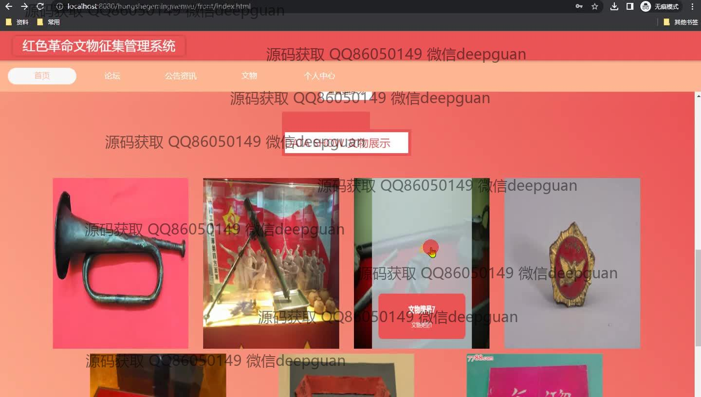
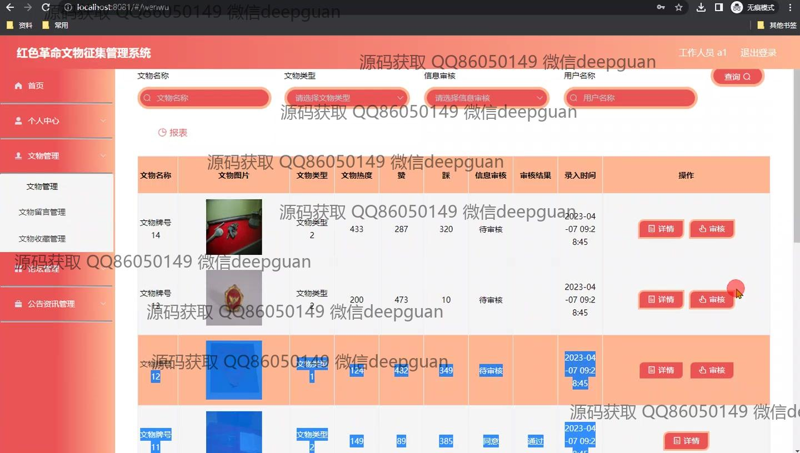

<h1 align="center">基于MVC模式的红色革命文物征集管理系统的设计与实现</h1>

## 简介
红色革命文物征集管理系统：角色分为管理员、用户；功能包括文物管理、论坛管理、公告资讯、个人中心、文物收藏、留言互动、信息审核及统计报表生成等，为用户提供全面的文物管理和交互体验。    --计算机毕业设计源码；毕设源码；java毕业设计源码

## 联系方式

<h3 align="center">获取完整代码与数据库文件 + 微信：deepguan QQ: 86050149 QQ群: 783742310</h3>

<h3 align="center">可帮忙远程部署 包运行成功！提供远程部署、修改代码、设计文档指导、代码讲解等服务！</h3>

## 功能介绍（完整见运行截图）
管理员：能够管理用户、工作人员和文物的信息，进行新增、删除、修改以及审核等操作。访问首页时可以查看系统统计报表，生成数据报表并分析。管理论坛包括帖子审核、回复及删除等。可以查看并管理公告资讯，监督文物信息的准确性和实时更新。个人中心提供个人信息管理和退出登录功能。

普通用户：可以在首页查看红色革命文物的展示，点击查看详细信息。论坛板块允许用户发布、查看和回复帖子，以及留言互动，促进信息交流。在文物管理模块中，通过检索和筛选，查看文物名称、图片、类型等详细信息，并进行点赞、评论等交互。个人中心提供对个人信息、我的收藏、留言管理等功能的访问。

## 运行截图

本代码来源于网络,仅供学习参考使用!

